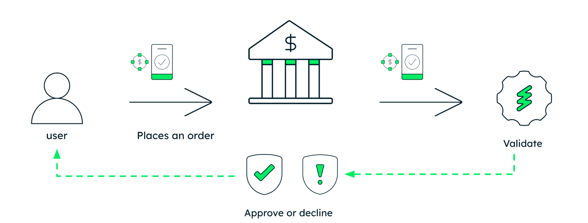
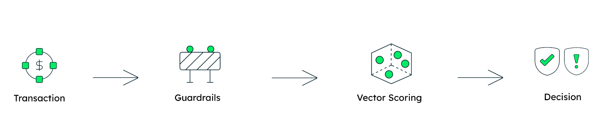
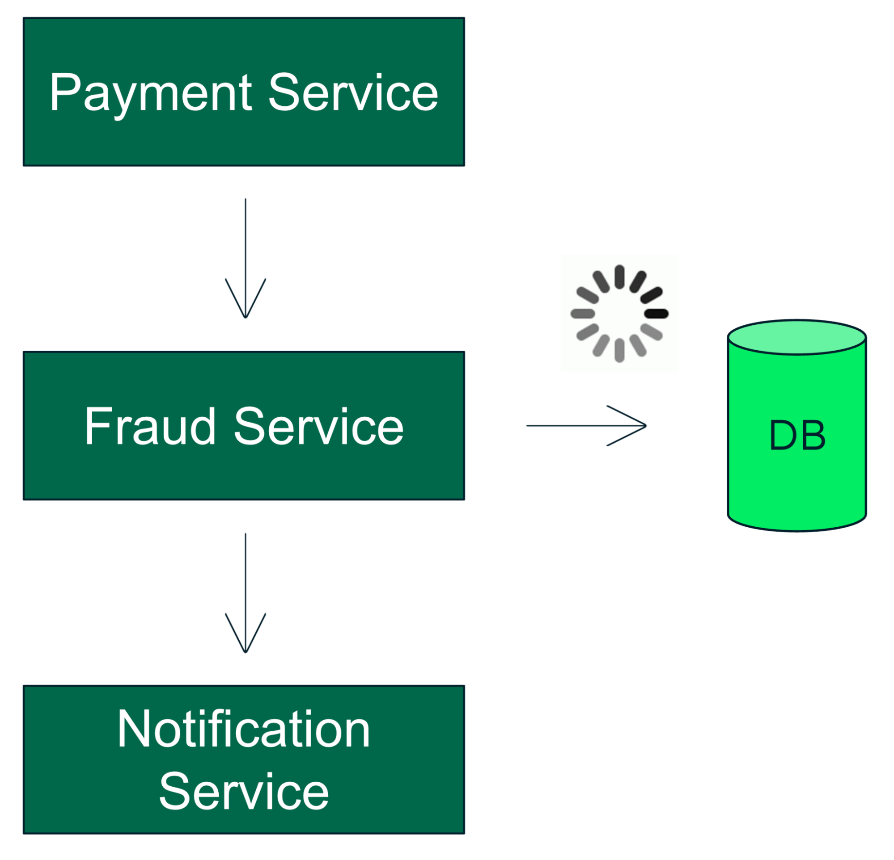
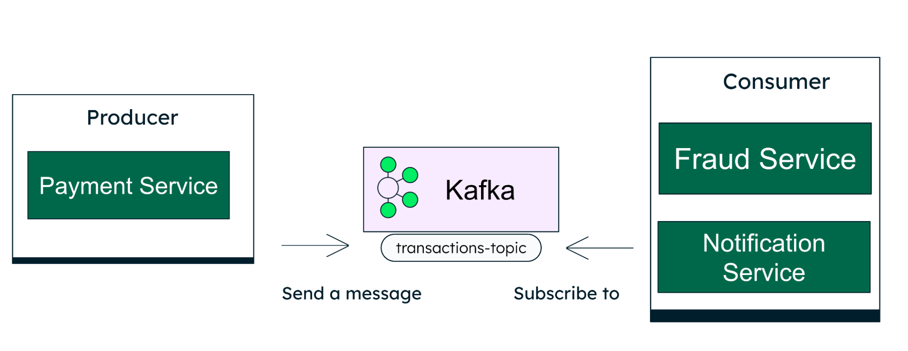
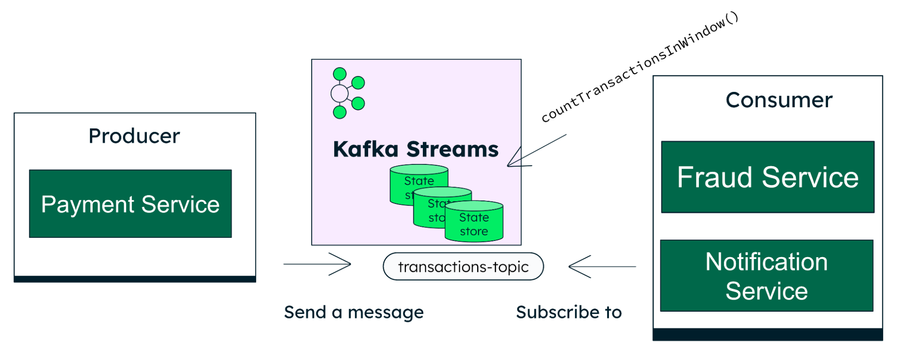
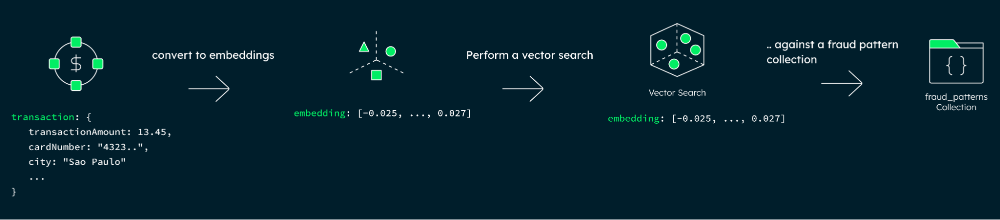
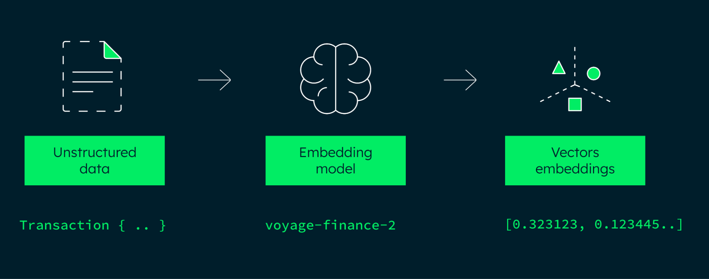
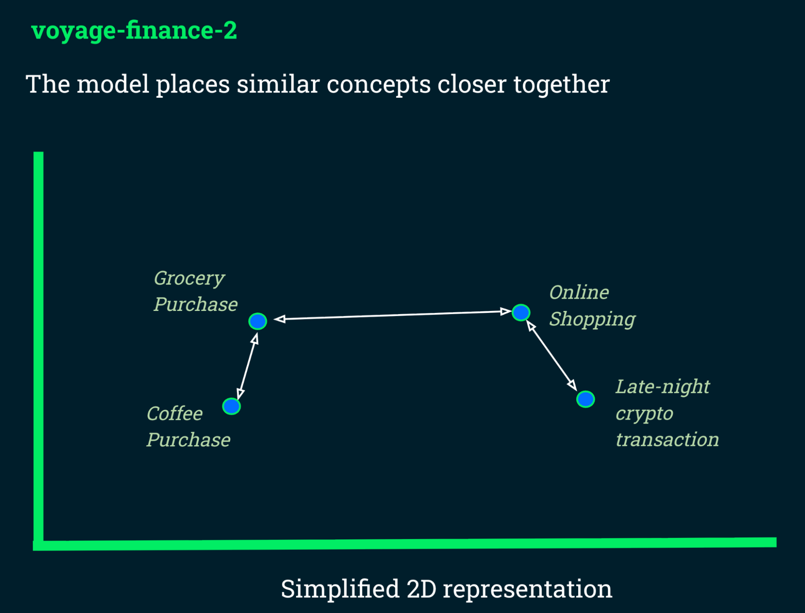

*This content is based on a talk that my colleague Tim Kelly and I presented at [DevNexus 2026](https://devnexus.com/events/real-time-fraud-detection-in-java-with-kafka-streams-vector-similarity) in Atlanta, one of the largest Java conferences in the world.*

Imagine you're at a supermarket or shopping online. You tap your card or click "Buy Now". In that exact moment, your bank has to make a decision: is this transaction legitimate, or is it fraud? And it has to do that in milliseconds, and get it right. If it blocks a real transaction, it frustrates the customer. If it approves a fraudulent one, it leads to financial loss. So the question is: how do banks actually do this? What's happening behind the scenes? In this article, we'll explore a real-world approach to solving this problem using Java, Apache Kafka, Kafka Streams, and vector similarity with MongoDB.

## What We're Building

At a high level, a payment system works like this: a transaction is created, it goes through a validation step, and then a final decision is made to approve or decline.



Now, let's zoom in on that validation step, because this is where fraud detection actually happens. In our approach, this validation is not a single check but a pipeline composed of multiple stages working together:



1. **Guardrails:** Rule-based checks that catch obvious and well-known fraud patterns immediately, like impossible travel or unusual transaction velocity.
2. **Vector Scoring:** AI-powered similarity matching that compares the transaction against known patterns to detect more subtle or behavioral fraud.
3. **Decision:** The final verdict is based on the combined output of both layers: route the transaction to the approved_transactions collection or to the suspicious_transactions collection for further review or definitive blocking.

The decision flow is pretty straightforward. If a transaction is flagged at any point, either by the guardrails or by the vector scoring stage, we treat it as suspicious and store it in the suspicious_transactions collection. From there, it can be reviewed, enriched with more context, or even blocked depending on the scenario. On the other hand, if it passes both layers without any issues, we consider it safe and store it in the approved_transactions collection.

## The Challenge: Millisecond Decisions with Resilience Under Failure

In fraud detection systems, especially in financial applications, speed is not just important, it is critical. Every transaction must be analyzed in real time, often under heavy load, with thousands of events happening every second. At the same time, the system cannot afford to break if a single component fails.

This leads to two non-negotiable constraints:

- Decisions must be made in milliseconds
- The system must remain resilient even when individual components fail

Before we get into how each layer works, it is important to understand how these constraints shape the entire architecture.

A natural first instinct is to build this using a simple synchronous architecture.



The payment service calls the fraud service, which then queries the database, and the flow continues to the notification service. This works fine at the beginning. It's simple and easy to understand.

But the problem is that everything is tightly connected. One service depends on the next. Now imagine the database takes a bit longer to respond. That delay starts to affect the whole flow. The fraud service slows down, the payment service has to wait, and the notification service also gets delayed.

At scale, this becomes a real issue. One slow component can impact everything else. So how do we break this dependency and make each service more independent? This is where event-driven architecture comes in.

## The Strategy: Decoupling the System with Event-Driven Architecture

Instead of having services call each other directly, we introduce an event log as the backbone of communication.

[Apache Kafka](https://kafka.apache.org/) allows the payment service to publish a transaction event to a topic, without knowing who will consume it. The fraud service, the notification service, and any other interested component can subscribe to that topic independently.



This fundamentally changes how the system behaves:

- Services are no longer tightly coupled
- Each service can fail or restart without affecting the others
- The system becomes more resilient and easier to scale

At this point, we have removed the direct dependency between services and solved the resilience problem. But we still have another challenge.

## Stateful Checks Without a Database Round-Trip

Many fraud detection techniques depend on understanding recent activity. For example, the system may need to evaluate how a card has been used within a short time window before deciding whether a new transaction is suspicious.

In a traditional architecture, this usually requires querying a database for every transaction. At high throughput, those round-trips add latency that quickly becomes a bottleneck. In a system where decisions must be made in milliseconds, this approach does not scale.

So the question becomes: How do we perform these kinds of checks without hitting the database every time?

### Solving It with Kafka Streams

[Kafka Streams](https://kafka.apache.org/documentation/streams/) is a lightweight Java library that runs inside your application, processing events as they flow through Kafka topics. More importantly, it allows us to maintain state locally.

Instead of querying a remote database for every transaction, we keep the necessary data inside the same process that handles the events, using an embedded store backed by RocksDB.



In our example, we want to analyze transaction activity per card within a short time window. To do that, we group events by card number. Each card number becomes a key, and for each key, the system maintains a running view of recent activity within a defined time window. This means we eliminate network calls and database round-trips from the critical path, relying only on local lookups. For our use case, this makes a big difference.

We avoid unnecessary latency and keep everything fast enough for real-time decisions, without depending on external systems. You can see where this happens directly [in the code](https://github.com/ricardohsmello/fraud-detection-streams-vector/blob/f5496ba6f8a0ad69dbb153e84f19e983f47589ef/src/main/java/com/devnexus/frauddetection/infrastructure/streams/topology/FraudDetectionStreamProcessor.java#L66):

```java
return stream
    .filter((key, tx) -> tx != null)
    .selectKey((key, tx) -> tx.cardNumber())
    .groupByKey(Grouped.with(Serdes.String(), transactionSerde))
    .aggregate(
        FraudDetectionState::empty,
        (cardNumber, newTransaction, currentState) -> { countTransactionsInWindow(); },
        Materialized.as("fraud-detection-store")...
    )
    .toStream()
```

This line is key:

```java
Materialized.as("fraud-detection-store")
```

It tells Kafka Streams to keep the state locally using an embedded store. As new transactions arrive, the state for each card is updated right there in the application, so the system can keep track of recent activity in real time.

At this point, we can evaluate transaction activity in real time without relying on database calls. But that raises an important question: What exactly are we measuring? Which patterns or signals should trigger a fraud decision? This is where guardrails come in.

## Stage 1: Guardrails, Fast Rule-Based Validation

Guardrails are the first layer in our flow. They're just simple checks based on rules, used to catch the most obvious fraud cases as early as possible.

In practice, guardrails can be any business or risk rule that makes sense for your domain. They are fully customizable and evolve over time as new fraud patterns emerge. In our case, we will implement a couple of common examples to illustrate the approach.

**Impossible Travel Check**

[This rule](https://github.com/ricardohsmello/fraud-detection-streams-vector/blob/f5496ba6f8a0ad69dbb153e84f19e983f47589ef/src/main/java/com/devnexus/frauddetection/domain/rules/ImpossibleTravelValidator.java#L20) checks if the same card shows up in places that don't make sense given the time between transactions.

For example, if a card is used in New York and then shows up in São Paulo less than an hour later, that's not realistic. Something is clearly wrong, and we treat that as a strong fraud signal.

```java
public boolean isImpossibleTravelFraud(Transaction previous, Transaction current) {
    double distanceKm = calculateDistanceKm(
        previous.latitude(), previous.longitude(),
        current.latitude(), current.longitude()
    );
    Duration timeBetween = Duration.between(
        previous.transactionTime(),
        current.transactionTime()
    ).abs();
    // block if physically impossible
}
```

**Velocity Check**

[The velocity](https://github.com/ricardohsmello/fraud-detection-streams-vector/blob/f5496ba6f8a0ad69dbb153e84f19e983f47589ef/src/main/java/com/devnexus/frauddetection/domain/rules/VelocityCheckValidator.java#L15) check looks at how many times a card is used in a short period of time. A very common pattern in fraud is when someone tests a stolen card by making several small transactions before trying something bigger.

In our case, if the same card is used more than three times within one minute, we flag it and block the transaction.

```java
public boolean isVelocityFraud(long txCountInWindow, long maxAllowedPerWindow) {
    return txCountInWindow > maxAllowedPerWindow;
}
```

These are just examples. In a real system, guardrails can include a wide range of checks depending on your use case, risk tolerance, and business rules.

## Where Rule-Based Detection Falls Short

Guardrails are fast and effective, but they have blind spots. Consider a transaction like this:

- Amount: $2.00
- City: same as the cardholder's usual city
- Card: same as always
- Activity: nothing unusual on the surface

This transaction would pass every guardrail check. But what if $2 micro-charges at gas stations are a known fraud pattern? This is a classic card-testing technique used before a larger fraudulent purchase. Rules alone cannot catch this, because the system would need to know the pattern in advance. This is where a different approach becomes necessary.

## Stage 2: Vector Scoring, Behavioral Fraud Detection



At this point, the question changes. Instead of asking: "Does this transaction violate a rule?" We ask: "Does this transaction behave like something we have seen before?"

To answer that, we need a way to compare transactions based on behavior, rather than exact values. For example:

- A $12 purchase at a coffee shop
- A $15 purchase at a bakery

These are not identical, but behaviorally they are very similar. On the other hand:

- A $10,000 crypto transaction at 3 AM

This is clearly very different. So how do we represent this idea in a way that a system can understand?

## From Transactions to Vectors

To compare behavior, we need a consistent way to represent a transaction. Instead of working with raw fields such as amount, merchant, or location separately, we transform the entire transaction into a single structured representation. One simple way to think about it is this:

We take a transaction like:

```json
{ "amount": 15.90, "merchant": "Gas Station", "city": "New York" }
```

And turn it into a descriptive text:

```java
String textToEmbed = "merchant=%s, city=%s, amount=%s";
```

This text is then passed to an embedding model, which produces a vector like:

[0.0392, 0.9323, -0.0323, ...]



In our case, we are using the voyage-finance-2 model, which is specialized for financial data from [Voyage AI](https://www.voyageai.com/). This model generates a vector with 1024 dimensions, where each value contributes to capturing a different aspect of the transaction's behavior.

In the application, this embedding generation step can be implemented with a [simple HTTP client in Spring](https://github.com/ricardohsmello/fraud-detection-streams-vector/blob/f5496ba6f8a0ad69dbb153e84f19e983f47589ef/src/main/java/com/devnexus/frauddetection/infrastructure/embedding/voyage/VoyageEmbeddingsClient.java#L13). For example:

```java
@HttpExchange(
    url = "/v1/embeddings",
    contentType = MediaType.APPLICATION_JSON_VALUE,
    accept = MediaType.APPLICATION_JSON_VALUE
)
public interface VoyageEmbeddingsClient {
    @PostExchange
    EmbeddingsResponse embed(@RequestBody EmbeddingsRequest body);
}
```

The role of this client is to send the transaction text to the embedding API and receive back the generated vector.

The model maps that description into a vector space where similar behaviors are placed closer together. This means that transactions that behave similarly will generate vectors that are close to each other.

To make this more intuitive, you can imagine a simplified 2D space.



In this space:

- Everyday purchases like coffee or groceries tend to cluster together
- Similar types of transactions stay close
- Unusual patterns, like a late-night crypto transaction, appear far apart

In reality, this space is not 2D, but has hundreds or thousands of dimensions. That is what allows the model to capture subtle patterns that are not obvious when looking at raw transaction data. The result is a numerical representation of the transaction that preserves its behavior, making it possible to compare transactions efficiently using vector similarity.

## Building the Baseline: Seeding the Fraud Pattern Collection

Now that we can convert transactions into vectors, we need something to compare them against. Vector similarity only works if we have a reference dataset.

This means we need a collection of known patterns that represent both normal and fraudulent behavior. To do that, [we create a `fraud_patterns` collection in MongoDB](https://github.com/ricardohsmello/fraud-detection-streams-vector/blob/f5496ba6f8a0ad69dbb153e84f19e983f47589ef/scripts/seed-nonfraud-patterns-100.mongosh#L141). Each document in this collection contains:

- The original transaction data
- A fraud label (true or false)
- The corresponding embedding

A normal pattern might look like this:

```json
{
  "fraud": false,
  "transaction": {
    "amount": 13.45,
    "merchant": "Coffee Shop"
  },
  "embedding": [ ... ]
}
```

A fraudulent pattern might look like this:

```json
{
  "fraud": true,
  "transaction": {
    "amount": 87422.45,
    "merchant": "Crypto Exchange"
  },
  "embedding": [ ... ]
}
```

This dataset acts as the baseline for comparison. Instead of asking "Is this transaction fraudulent?", we ask: "Does this transaction look like something we already know?"

## How This Collection Evolves

This collection does not need to be perfect from the start. It typically begins with a small, curated set of known patterns. As the system runs in production:

- Confirmed fraud cases can be added
- New patterns can be introduced immediately
- The system improves over time

One important advantage here is that we do not need to retrain a model. We simply add new examples to the dataset.

## Running Vector Search with MongoDB

To run a vector search, we need to [create a vector index](https://www.mongodb.com/docs/atlas/atlas-vector-search/vector-search-type/). This index allows MongoDB to efficiently search for similar vectors.

```json
{
  "fields": [
    {
      "type": "vector",
      "path": "embedding",
      "numDimensions": 1024,
      "similarity": "cosine"
    }
  ]
}
```

Each field here matters:

- type: "vector" tells MongoDB that this field contains embeddings
- path: "embedding" defines where the vector is stored in the document
- numDimensions: 1024 must match the size of the vectors produced by the model
- similarity: "cosine" defines how similarity between vectors is calculated

If the number of dimensions does not match the embedding model, the index will not work correctly.

## Performing the Search

Once the index is in place, MongoDB can efficiently find the nearest vectors. From [Spring Data MongoDB](https://docs.spring.io/spring-data/mongodb/reference/mongodb/repositories/vector-search.html#vector-search.model.scoring), this becomes very straightforward:

```java
@Repository
public interface FraudPatternRepository extends MongoRepository<FraudPattern, String> {

    @VectorSearch(
        indexName = "fraud_patterns_vector_index",
        limit = "10",
        numCandidates = "200"
    )
    SearchResults<FraudPattern> searchTopFraudPatternsByEmbeddingNear(
        Vector vector,
        Score score
    );
}
```

This [method](https://github.com/ricardohsmello/fraud-detection-streams-vector/blob/9b1bd48b6d01be79ed3d9ec65a463cc9b171b591/src/main/java/com/devnexus/frauddetection/infrastructure/database/repository/FraudPatternRepository.java#L19) takes the transaction embedding as input and returns the most similar patterns stored in the collection.

## Not All Matches Are Equal: Introducing the Threshold

After running the search, MongoDB returns the closest matches along with similarity scores. For example:

- Result 1 = score: 0.94
- Result 2 = score: 0.91
- Result 3 = score: 0.72
- Result 4 = score: 0.60

Each score tells us how similar a stored pattern is to the transaction we are analyzing. In practice, vector search returns the closest matches available, even when the similarity is relatively low.

That is why we introduce a threshold. A threshold defines the [minimum similarity](https://github.com/ricardohsmello/fraud-detection-streams-vector/blob/9b1bd48b6d01be79ed3d9ec65a463cc9b171b591/src/main/resources/application.yml#L65) score required for a result to be considered relevant.

```yaml
similarity-threshold: 0.95
```

Any result below this value is ignored. Choosing the right threshold is critical:

- Too low → many false positives
- Too high → missed fraud cases

The ideal value depends on your domain and risk tolerance.

## The Full Architecture

Putting it all together, the flow looks like this:

![Full architecture diagram: a client app sends a transaction through a TransactionController and TransactionProducer to a FraudDetectionProcessor running guardrails checks in Kafka Streams. Suspicious transactions are saved to a suspicious_transactions repository; non-suspicious ones go through a FraudPatternSearch vector scoring step using Voyage AI embeddings and a vector search against fraud patterns, routing to either the suspicious or approved transaction repository, both backed by MongoDB Atlas.](fraud-detection-full-architecture.png)

- **Client App** produces a transaction event to a Kafka topic.
- **FraudDetectorProcessor** consumes the event via Kafka Streams.
- **Guardrails** run first: velocity check using local state store and impossible travel check. If triggered, the transaction is immediately inserted into the suspicious_transactions collection.
- If it passes guardrails, it proceeds to **Vector Scoring**.
- The transaction is converted into an embedding and compared against fraud patterns in MongoDB using cosine similarity.
- If the score exceeds the threshold against a fraud-labeled pattern, the transaction is **flagged as suspicious**. Otherwise, it is **approved**.
- Results flow to downstream services via Kafka.

## Beyond Rules and Similarity

What we built here is just one way to approach fraud detection. We combined simple rule-based checks with vector similarity to detect patterns in real time. Guardrails work really well for obvious cases, while vector search helps catch things that don't follow clear rules.

But fraud detection is not the same for everyone. Something that looks suspicious for one user might be totally normal for another. For example, a late-night crypto transaction might be unusual for most people, but not for someone who trades crypto regularly.

That's where things can evolve. One next step would be to include some form of user profiling, where the system learns how each user behaves over time and uses that as part of the decision. Instead of only comparing against global patterns, we could also compare against the user's own history. That adds more context and helps reduce false positives.

At the end of the day, it's about combining different approaches: simple rules for quick decisions, vector similarity for behavior, and more context to better understand each user.

## Source Code

The full project is available on [GitHub](https://github.com/ricardohsmello/fraud-detection-streams-vector). You can check out the code, run it locally, and see how everything fits together, from Kafka Streams and guardrails to vector scoring and MongoDB.

You'll also find all the setup instructions in the README, including how to start Kafka, configure the embedding generator, and run simulations to test different scenarios.
