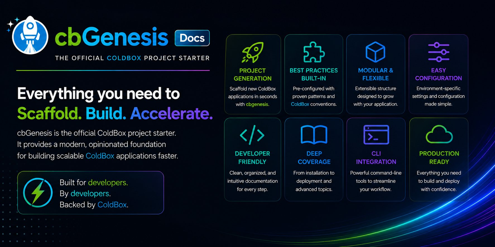

**Ortus Solutions today announces the general availability of [cbGenesis 1.0](https://cbgenesis.coldbox.org), a production-ready ColdBox HMVC starter template for BoxLang, and the first one designed from day one to be built *with* an AI coding agent, not just *by* one.**



For twenty years, **ColdBox** has been one of the most battle-tested HMVC frameworks in the CFML and BoxLang world. **cbGenesis** takes that foundation and ships the part every team rebuilds by hand: authentication, permissions, security hardening, an admin panel, tests, and the guidance an AI agent needs to extend all of it correctly.



In combination with our new CommandBox BoxLang CLI (`bx-cli`), you can get started easily with one command:

```bash
coldbox create app name="my-app" skeleton="cbgenesis"
```

That's it. Minutes later you're looking at a login screen backed by real authentication, real role-based permissions, and a real admin panel. Not a TODO comment telling you to build one.

> **Important:** It requires the CommandBox BoxLang module (`bx-cli`). See the [cbGenesis Getting Started guide](https://cbgenesis.coldbox.org/getting-started/).

## BoxLang: the productivity platform AI already knows how to use

Every serious app today gets built with an AI coding agent somewhere in the loop. The question is no longer *whether* your team uses AI, but *which platform lets AI be productive*.

That is exactly what we built [BoxLang](https://boxlang.io) to be. BoxLang is a modern, dynamic JVM language with 100% Java interop, and the entire Box ecosystem around it (ColdBox, CommandBox, TestBox, WireBox and hundreds of modules) ships with structured, machine-readable knowledge that agents consume directly:

- **Skills** that teach agents how BoxLang and every framework in the stack actually work
- **Live MCP documentation servers** so agents read current docs instead of guessing from a training cutoff
- **Conventions over configuration**, so there is one obvious way to do things and agents follow it

The result: agents don't fight the platform, they work with it. **cbGenesis** is the clearest proof of that yet. It's not just a starter template; it's a codebase that tells your agent, and you, exactly how things are done here.

Hand an agent a blank app and ask it for auth, RBAC, an admin panel, and CSRF protection, and it doesn't just cost you time. It costs tokens, and it costs consistency. With nothing to imitate, it either invents its own conventions or re-derives security-sensitive plumbing from scratch, with no guarantee it gets the subtle parts right. cbGenesis removes that guesswork.

## What's in the box

cbGenesis ships as a complete, working admin application, not a skeleton you fill in:

- **Authentication:** session-based auth, with email verification and self-service password reset ([Security guide](https://cbgenesis.coldbox.org/guides/security/))
- **SSO and passkeys:** Multi-Provider OAuth via cbSSO with account linking, plus WebAuthn passkeys for passwordless sign-in
- **RBAC:** a `resource:action` permission model enforced at the framework level via `@secured` annotations
- **CSRF protection:** deny-by-default on every state-changing request, with automatic token rotation on the frontend
- **API access:** hashed personal API tokens and JWT support
- **Hardening:** IP-based rate limiting on login, registration and password reset, plus security headers
- **Audit log:** every sign-in, sign-out and access failure, searchable and exportable
- **Data:** BoxLang ORM and qb with migrations ([Database and ORM guide](https://cbgenesis.coldbox.org/guides/database-orm/))
- **Frontend:** Alpine.js components over server-rendered views, Bootstrap 5, dark mode, compiled by Vite with hot module reload ([Frontend guide](https://cbgenesis.coldbox.org/guides/frontend/))
- **Storage and mail:** multi-provider file storage via CBFS and templated email via cbmailservices
- **Tests:** a real TestBox suite with unit specs for entities and services, and integration specs that exercise real HTTP requests ([Testing guide](https://cbgenesis.coldbox.org/guides/testing/))
- **Deployment:** Docker Compose for local dev and a production-ready deployment path ([Deployment guide](https://cbgenesis.coldbox.org/deployment/))

### The admin panel, end to end


login.png | Login: the default AuthSplit layout
 dashboard.png | Dashboard: after signing in
 users.png | Users: search, invite, manage accounts
 roles.png | Roles: group permissions, assign users
 permissions.png | Permissions: resource:action, grouped by resource
 settings.png | Settings: DB-backed config, no redeploy needed
 profile.png | Profile: avatar, passkeys, API tokens
 auditlog.png | Audit Log: every sign-in and access failure


## Built for AI-assisted development, and we measured it

Claims about AI productivity are cheap, so we ran an actual test instead of just asserting a number.

**The task:** add a complete CRUD resource to this exact codebase. An ORM entity, a service, a permission-gated JSON handler, a route, and an Alpine.js frontend component with correct CSRF handling. Same task, two independent agent runs, same commit, same model.

One agent worked with no access to cbGenesis's custom skills and had to reverse-engineer every convention itself. The other was pointed at the three relevant skills (`cbgenesis-crud-resource`, `cbgenesis-csrf-frontend`, `cbgenesis-rbac-permissions`) first.

| | Exploration only | Skill-assisted | Improvement |
|---|---:|---:|---:|
| **Tokens** | 129,672 | **113,995** | 12% fewer |
| **Tool calls** | 38 | **22** | 42% fewer |
| **Wall time** | 208s | **137s** | 34% faster |

Identical scope, measurably less work. This was one measured run, not an averaged benchmark, so treat it as directional. Run the comparison yourself on a task you care about; we'd rather you verify it than take our word for it.

What ships to make that possible ([AI-Native guide](https://cbgenesis.coldbox.org/ai-native/)):

- **`AGENTS.md`** at the repo root, the file most agent tooling (Claude Code, Copilot, Cursor) loads automatically, describing the app's structure, handlers, interceptors and conventions before an agent writes a line of code.
- **90+ framework skills**, installed by the ColdBox CLI, covering BoxLang, ColdBox, CommandBox, TestBox, WireBox and every bundled module.
- **Six cbGenesis-specific skills** capturing what framework skills can't know: this app's permission model, its CSRF frontend contract, and the exact shape a new feature here follows.
- **Live MCP documentation servers** for the whole stack, so agents check current docs instead of guessing.

## A peek at the code

Security here isn't a scattering of `if` checks. It's declared once, on the handler action, and enforced by the framework:

```java
class extends="BaseSecureHandler" {

    @secured( "roles:admin,roles:read" )
    function index( event, rc, prc ) {
        // list + search
    }

    @secured( "roles:admin,roles:write" )
    function create( event, rc, prc ) {
        // create a role
    }

    @secured( "roles:admin,roles:delete" )
    function delete( event, rc, prc ) {
        // delete a role
    }

}
```

On the frontend, every mutating request goes through a helper that transparently recovers from a stale CSRF token instead of silently failing:

```javascript
const response = await fetchWithCsrf( this, "/users/123", "PUT", ( csrf ) => ( {
    headers : { "Content-Type": "application/x-www-form-urlencoded" },
    body    : new URLSearchParams( { ...data, csrf } ),
} ) );
```

If the token has gone stale, `fetchWithCsrf` refreshes it and retries once, automatically. One less class of bug for you or your agent to reintroduce per form. Dig deeper in the [Architecture](https://cbgenesis.coldbox.org/architecture/) and [Handlers and Routing](https://cbgenesis.coldbox.org/guides/handlers-routing/) guides.

## Watch it in action



## Get started

**Requirements:** Java 21+, BoxLang 1.17+, CommandBox 7+, ColdBox 8+, Node.js 22+, and a supported database (MySQL 8+, MariaDB, PostgreSQL, SQLite, Oracle or MSSQL).

```bash
# Install BoxLang: https://boxlang.ortusbooks.com/getting-started/installation
curl -fsSL https://install.boxlang.io/ | bash

# Install the CommandBox BoxLang CLI module
install-bx-module bx-cli

# Scaffold your app & Install Dependencies
box install coldbox-cli
box coldbox create app name="my-app" skeleton="cbgenesis"
npm install

# Database and AI setup
migrate install
migrate up --seed
coldbox ai refresh

# Run it
server start
npm run dev   # in a second terminal
```

Open `http://127.0.0.1:8080` and sign in with the seeded admin account. Full walkthrough, including default credentials and configuration, in the [Getting Started guide](https://cbgenesis.coldbox.org/getting-started/) and the [Configuration guide](https://cbgenesis.coldbox.org/guides/configuration/).

## Thank you, Loeb Electric and Gary Knight

cbGenesis exists thanks to the sponsorship of **[Loeb Electric](https://loebelectric.com)** and **Gary Knight**. Their investment made it possible to turn years of hard-won patterns from real enterprise ColdBox and BoxLang applications into an open-source foundation the entire community can build on. This is open source working exactly as it should: one organization invests, and every developer benefits. Thank you, Gary and the whole Loeb Electric team.

Want to sponsor the next big piece of the Box ecosystem? [Talk to us](https://www.ortussolutions.com/services) or support us on [Patreon](https://www.patreon.com/ortussolutions).

## This is just the beginning

cbGenesis 1.0 is a start, not a finish line. We have much more coming to the starter template soon: more features, more skills, and more ways to go from idea to production with BoxLang and your agent of choice. Follow along on [GitHub](https://github.com/coldbox-templates/cbGenesis), star the repo, and tell us what you want to see next in the [Ortus Community Slack](https://www.ortussolutions.com/community/slack).

## Resources

- **Website and docs:** [cbgenesis.coldbox.org](https://cbgenesis.coldbox.org)
- **Source:** [github.com/coldbox-templates/cbGenesis](https://github.com/coldbox-templates/cbGenesis) (Apache 2.0)
- **BoxLang:** [boxlang.io](https://boxlang.io) | [BoxLang docs](https://boxlang.ortusbooks.com)
- **ColdBox:** [coldbox.org](https://www.coldbox.org)
- **Professional support and consulting:** [ortussolutions.com/services](https://www.ortussolutions.com/services)

Stop scaffolding auth. Start building the thing only your app does.
