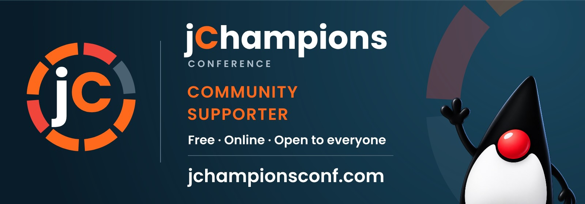

jChampions Conference is a free, virtual conference organized by and featuring Java Champions, held annually in January across four days with sessions from the global Java community. It welcomes free community sponsorships from companies and Java User Groups who want to promote the event, and any company or JUG can become a free community sponsor in return for sharing it with their audience.

