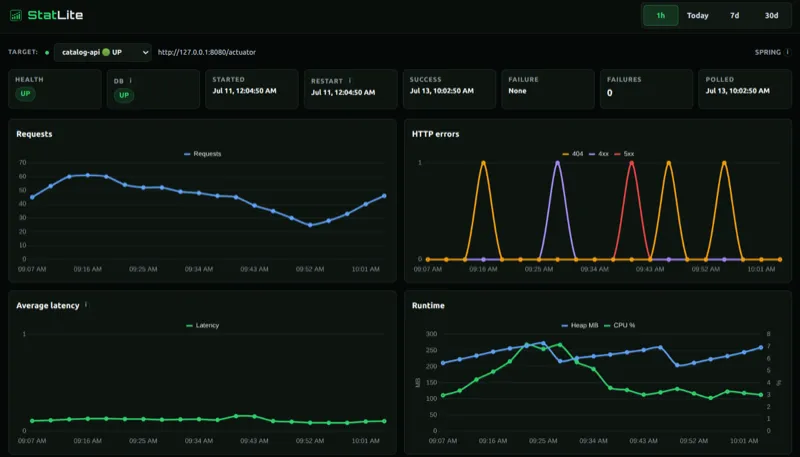

Running one Spring Boot application or a handful of them on a VPS still calls for basic operational visibility. You need to know whether an application is reachable, whether errors are rising, and whether it restarted. You may not need a complete monitoring platform to answer those questions.

Spring Boot Actuator already exposes much of that information through its health endpoint and Micrometer metrics. [StatLite](https://github.com/PVRLabs/statlite) turns it into a focused dashboard for health, requests, errors, latency, memory, uptime, and restarts. It runs as one Go binary and stores its history in SQLite.



## Why the usual options can be more than you need

Actuator gives Spring Boot applications useful health and Micrometer metrics endpoints. They are excellent for integration, but repeatedly opening JSON endpoints is not a convenient everyday dashboard.

[Spring Boot Admin](https://codecentric.github.io/spring-boot-admin/current/) provides rich application administration, but running a separate Spring Boot application for monitoring can be heavy on a small VPS. **Prometheus and Grafana** are strong choices when you need a larger monitoring system, flexible queries, or long-term retention across an estate.

For a few services on one VPS, a narrower dashboard can be enough. StatLite reads the Actuator data you already have and shows the operational signals most useful during routine checks.

## Quick comparison

| Tool | Operational complexity | Best fit |
| --- | --- | --- |
| Raw Actuator endpoints | Low | Occasional manual checks |
| Spring Boot Admin | Medium (requires Java runtime & memory) | Application administration and monitoring |
| Prometheus and Grafana | High | Larger deployments and advanced observability |
| StatLite | Very low (single Go binary + SQLite) | A few Spring Boot services on a small server |

These tools can also coexist. Choosing StatLite for a focused dashboard today does not prevent adopting Prometheus and Grafana later if your requirements grow.

## Set up StatLite in a few minutes

These steps assume an existing Spring Boot application with Actuator. To try StatLite without one, the repository includes a runnable [Spring Actuator demo](https://github.com/PVRLabs/statlite/tree/main/examples/spring-actuator-demo) with a traffic generator.

### 1. Expose health and Prometheus metrics from Spring Boot

Add `io.micrometer:micrometer-registry-prometheus` if the application does not already include it, then expose health and the Prometheus endpoint. Keep Actuator reachable only from trusted networks and add authentication where your deployment requires it.

```yaml
management:
  endpoints:
    web:
      exposure:
        include: health,prometheus
  endpoint:
    health:
      show-details: always
```

### 2. Install StatLite

The recommended path on macOS or Linux is the release installer, which installs `statlite` to `~/.local/bin`:

```bash
curl -fsSL https://raw.githubusercontent.com/PVRLabs/statlite/main/install.sh | sh
```

Add `~/.local/bin` to your `PATH` if it is not already included. For Homebrew and other options, see the [StatLite installation guide](https://github.com/PVRLabs/statlite/blob/main/docs/install.md).

### 3. Add one target configuration

Save the following as `statlite.yaml`:

```yaml
server:
  listen: "127.0.0.1:9090"

storage:
  sqlite_path: "./statlite.sqlite"

polling:
  interval: "30s"
  timeout: "5s"

targets:
  - name: "my-spring-app"
    type: "spring"
    url: "http://127.0.0.1:8080/actuator"
```

`listen` keeps the dashboard local by default. `sqlite_path` is the file used for dashboard history. `url` is the Actuator management base URL. StatLite collects health from Actuator and application metrics from `/actuator/prometheus`. For Basic Auth, multiple targets, retention, and production security details, see the [configuration documentation](https://github.com/PVRLabs/statlite/blob/main/docs/configuration.md).

### 4. Open the dashboard

```bash
statlite --config ./statlite.yaml
```

Open `http://127.0.0.1:9090` in a browser. StatLite polls on the configured interval, so wait for the next poll after creating traffic or restarting the application.

## Why StatLite stays small

- No Java agent or per-application monitoring agent
- No custom application instrumentation beyond Actuator and Micrometer
- Multiple Spring Boot targets in one configuration

It is intentionally Actuator-first. You enable or expose Actuator as needed; StatLite does not remove that setup step.

## When not to use StatLite

Use a broader observability platform when you need many services or hosts, long retention, advanced metric queries, alert routing, distributed tracing, centralized logs, or organization-wide dashboards.

StatLite is not a replacement for enterprise observability. It is a focused option when the operational job is to monitor a few Spring Boot applications without operating a full Prometheus and Grafana stack.

## Related resources

For a 512 MB VPS measurement with Spring Boot and the dashboard included, see [Spring Boot on a 512 MB VPS: How Lightweight Monitoring Still Fits](https://pvrlabs.xyz/articles/spring-boot-512mb-vps.html).

For a Spring Boot API that slows down during a CPU-heavy job, see [My API Is Up, but Slow. Is It My Code or the Server?](https://pvrlabs.xyz/articles/api-slow-cpu-contention.html)
